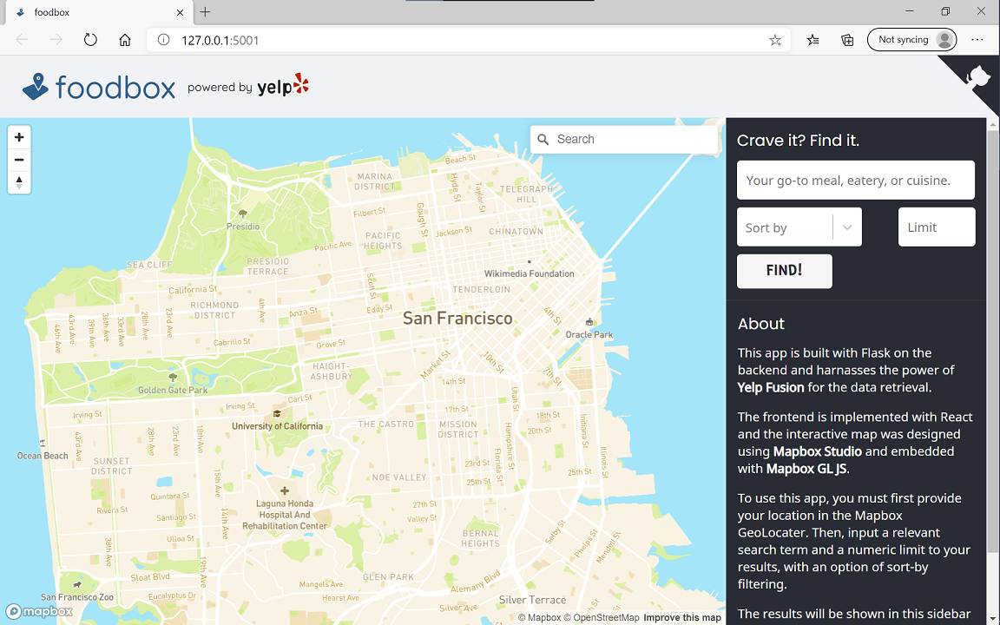
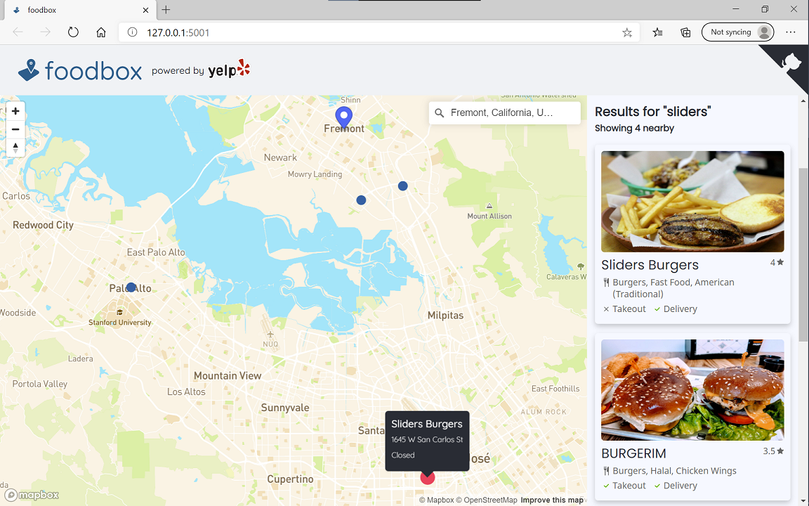

# foodbox



This was a fun, yet rewarding project of mine to dip my feet in the world of web development. This application is built with Flask on the backend and 
implements Yelp's Fusion API to retrieve a wealth of available food choices from user input. The frontend is built with ReactJS and the custom map style was made 
available through Mapbox. 

Because we are in the midst of a global pandemic, I also decided it would be useful to visibly emphasize the availability of takeout and delivery options for 
each eatery. Takeout and delivery options are clearly marked with a  if available, or with an  if not. 

## Get it running
### Docker

To play with this app with Docker, use the following command
```
$ docker run -d -p 5000:5000 --name foodbox-app hbattu/foodbox
```
To stop the application 
```
$ docker stop foodbox-app
```
### AWS Elastic Beanstalk
The app is also hosted on the following url: http://foodbox-env-2.eba-8tsswabp.us-west-1.elasticbeanstalk.com/

## How to use



You must first input your desired location in the Mapbox Geolocater in the top right of the map. Then simply enter a relevant search term, a sort-by option, and an
integer limit to your results. The results will be rendered in the sidebar to the right and plotted in the map.

Clicking on a card will redirect to the Yelp page for that specific eatery. Hovering over a card in the sidebar highlights the marker of that eatery in the map. 
Hovering over a marker in the map presents further info in a pop-up.

## Known Bugs

* For some eateries, the JSON data retreived from Fusion will not include the `hours` attribute and an error will be thrown to the console. 
  The results will still be rendered but won't be plotted in the map.
